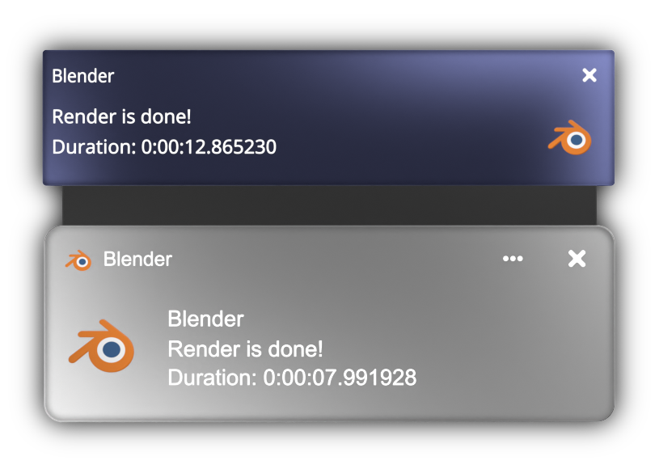

# BlenderSystemNotifier
Notifier *should* support versions >2.80. It was built for 3.3.0

Notify Sends a system notification when your render is complete, 
works on linux and windows.

  

How to install:

1.  Clone or Download the github
3.  Extract files anywhere
4.  Open Blender
5.  Go to file / user preferences
6.  Click on the Add-on tab
7.  Hit install from file
8.  Locate the Notifier.py script
7.  Check the box next to "system: notify" on your add-ons tab
8.  Save preferences, if you don't have auto-save on

Notifier supports notifications in 7 languages: English, Spanish, Catalan, Italian, French, German and Portuguese
Notifier will auto detect the sytem language.
